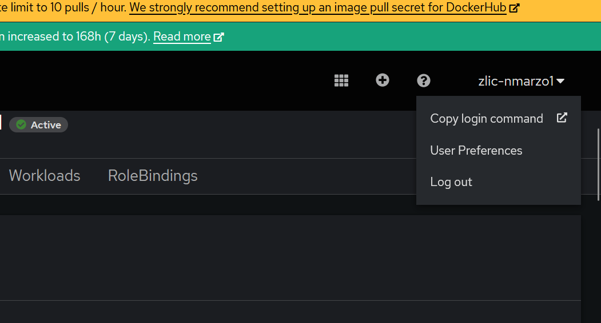

# M109

## Wichtige Commands

### Openshift

#### login

Um sich einzulogen muss man unter dem Benutzer den login command kopieren.



diesen Befehl kann man dan direkt ins CMD einfügen.

#### Projekt wechseln

mit ```oc projects``` kann man alle Projekte anzeigen lassen.

mit ```oc project``` kann man dann das Projekt auswählen.

**Beispiel**

```
oc project 254201-zlic-nmarzo1
```
