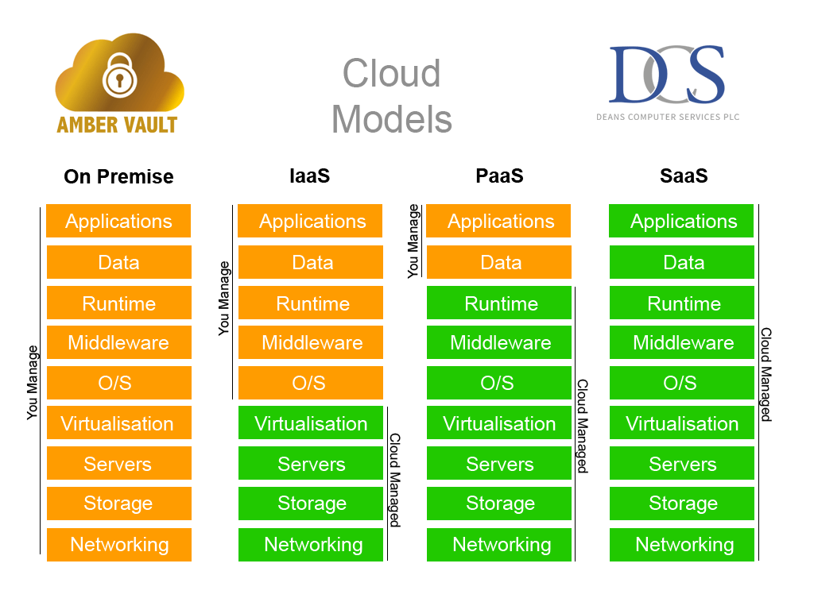

# M109

## Wichtige Commands

### Openshift

#### login

Um sich einzulogen muss man unter dem Benutzer den login command kopieren.


diesen Befehl kann man dan direkt ins CMD einfügen.

#### Projekt wechseln

mit ```oc projects``` kann man alle Projekte anzeigen lassen.

mit ```oc project``` kann man dann das Projekt auswählen.

**Beispiel**

```
oc project 254201-zlic-nmarzo1
```

#### Ressourcen applyen

Mit dem Befehl `oc apply -f <datei.yaml>` kannst du Ressourcen wie Pods, Services oder Deployments in OpenShift erstellen oder aktualisieren. Die Datei `<datei.yaml>` enthält die Konfiguration der Ressource, die du anwenden möchtest.

**Beispiel:**
```
oc apply -f mein-ayri.yaml
```

Einen ganzen Ordner kann man mit dem Parameter `--recursive` machen.

**Beispiel:**

```
oc apply -f /diddyblud --recursive
```

#### Ressourcen mit selben Tag löschen
```K8s
oc delete all --selector=app=html-openshift-app
```

## Wichtige Begriffe

### Economies of Scale

**Je mehr Kunden sie bedienen, desto günstiger wird der Betrieb pro Kunde.**s

Cloud-Provider investieren einmal in riesige Rechenzentren → dann verteilen sie die Kosten auf Millionen Kunden:

| Beispiel                       | Effekt                                        |
| ------------------------------ | --------------------------------------------- |
| Große Mengen an Servern kaufen | Günstigere Stückpreise bei Hardware           |
| Automatisierung von Prozessen  | Weniger Personal = niedrigere Kosten          |
| Standardisierte Services       | Weniger Komplexität = effizientere Verwaltung |

### Service Modelle



### 5 Merkmale einer Cloud?

1. On-Demand Self-Service
2. Broad Network Access
3. Resource Pooling
4. Rapid Elasticity
5. Measurable Service (Pay-as-you-go)

### Wichtige Container Engines

- Docker
- Budha
- Podman
- CRI-O

### Wichtige Container Orchistration

- Docker Swarm/Compose
- Kubernetes

### Wichtige "Container Orchistration Enhancments"

- Openshift
- Tanzu